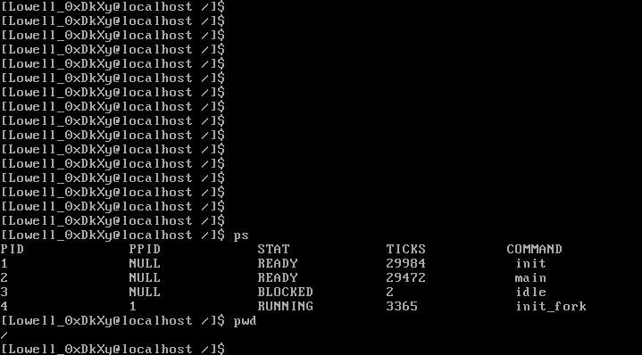

# AOS

It is an operating system kernel made from strach by myself.

Just for fun.

## TODO

- [ ] support QEMU
- [ ] support GRUB as bootloader
- [x] user mode
- [x] file system
- [x] disk driver
- [x] fork
- [x] shell
- [x] basic built-in commands
- [ ] load user programs
- [ ] pipeline
- [ ] copy-on-write
- [ ] network driver
- [ ] support RISC-V
